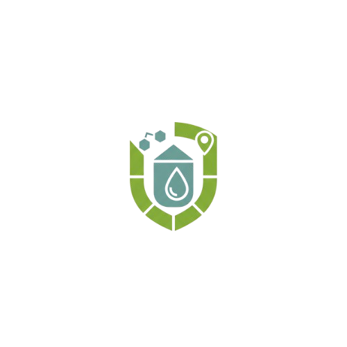

<<<<<<< HEAD
# Kaydso — Predict. Prepare. Protect.

**Kaydso** is a government-focused early warning system designed to predict and mitigate drought, water scarcity, and food storage risks before they become crises. This platform connects data, communities, and decision-makers to ensure rapid response and transparency.



## 🚀 Overview

Kaydso provides a "calm control" interface for government officials and NGOs, offering:
- **Predictive Analytics:** Early warning signals for dry lands and storage instability.
- **Real-time Monitoring:** Live dashboard simulations for district-level risk assessment.
- **Community Action:** Tools for villagers to report infrastructure issues (wells, silos).
- **Charity Coordination:** Direct connection between data-driven needs and donor funding.

## 🛠️ Tech Stack

Built with modern, high-performance web technologies:

- **Framework:** [Next.js 15+](https://nextjs.org/) (App Router)
- **Language:** [TypeScript](https://www.typescriptlang.org/)
- **Styling:** [Tailwind CSS v4](https://tailwindcss.com/)
- **Animations:** [Framer Motion](https://www.framer.com/motion/) (Scroll-triggered, Parallax, Micro-interactions)
- **Icons:** [Lucide React](https://lucide.dev/)
- **Fonts:** [Outfit](https://fonts.google.com/specimen/Outfit) (Google Fonts)

## ✨ Key Sections

1.  **Hero:** Immersive parallax experience with rotating key messages ("Predict. Prepare. Protect.") in Matcha Green.
2.  **About Us:** Strategic overview featuring our **Vision** & **Mission** pillars ("Predict & Prevent", "Community Voice", "Unified Action").
3.  **How It Works:** Step-by-step breakdown of the data-to-action pipeline.
4.  **Dashboard Demo:** Interactive map simulation showing risk levels (Stable, Warning, Critical) and live alerts.
5.  **Charity Support:** Dedicated section for donation progress tracking (e.g., Well Repair in Garadag Village).
6.  **Contact & Reporting:** Integrated community reporting interface for infrastructure maintenance and general inquiries.
7.  **Government Endorsements:** Testimonials from regional governors (Badhasabka Gobolka) validating the system's impact.
8.  **Government Access:** Secure portal entry for official use.

## 📱 Mobile Responsiveness

The platform is fully optimized for all devices:
- **Hamburger Menu:** Smooth, glassmorphism-styled mobile navigation.
- **Adaptive Layouts:** Grid systems that stack gracefully on smaller screens.
- **Touch Interactions:** Buttons and interactive elements sized for mobile use.

## 📦 Getting Started

To run the Kaydso system locally:

1.  **Clone the repository:**
    ```bash
    git clone https://github.com/your-org/kaydso-web.git
    cd kaydso-web
    ```

2.  **Install dependencies:**
    ```bash
    npm install
    # or
    yarn install
    ```

3.  **Run the development server:**
    ```bash
    npm run dev
    ```

4.  Open [http://localhost:3000](http://localhost:3000) with your browser to launch the system.

## 🎨 Design Philosophy

- **Colors:** `#B4CCCF` (Calm Backgrounds), `#8FB78F` (Matcha Green - Action/Growth), `Red/Amber` (Alerts Only).
- **Aesthetics:** Clean, professional, "Antigravity-style" motion, glassmorphism effects.
- **Accessibility:** High contrast text, clear focus states, and responsive layout.

## 📄 License

This project is proprietary software designed for government and NGO use. All rights reserved.

---
*Built with ❤️ for a resilient Future By Kaydso Team.*
=======
# Kaydso-Site
>>>>>>> 67f19b12bba736603d3e3418a030166992dc7cde
